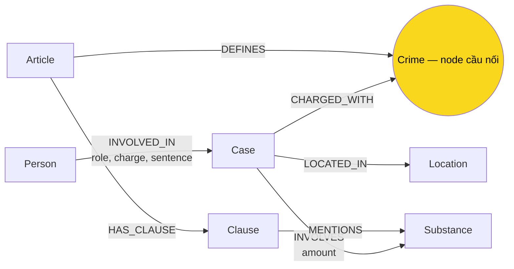

# Thiết kế Ontology — Day 19

**Họ tên:** Nguyễn Ngọc Vinh
**MSSV:** 2A202602833

**Lựa chọn:** Dùng ontology gợi ý. Cài đặt giữ nguyên các nhãn và quan hệ dưới đây để việc xây graph, truy vấn Cypher và báo cáo nhất quán.

## 1. Sơ đồ

## 2. Entity types (node labels)

| Label | Ý nghĩa | Khóa định danh (`MERGE` theo) | Properties | KB | Trích xuất |
| --- | --- | --- | --- | --- | --- |
| `Article` | Một Điều luật | `id` | `title`, `law`, `doc_id` | Luật | Regex/front matter |
| `Clause` | Một khoản của Điều luật | `id` | `number`, `penalty`, `text`, `doc_id` | Luật | Regex |
| `Crime` | Tội danh chuẩn hoá, dùng chung hai KB | `name` | `name` | Cả hai | Tiêu đề luật + LLM/linking |
| `Case` | Một vụ việc trong bài báo | `name` | `summary`, `date`, `source_title`, `doc_id` | Tin tức | LLM JSON |
| `Person` | Người xuất hiện trong vụ việc | `name` | `aliases` | Tin tức | LLM JSON |
| `Substance` | Chất ma túy | `name` | `name` | Cả hai | Từ điển/regex và LLM |
| `Location` | Địa điểm vụ việc | `name` | `name` | Tin tức | LLM JSON |

Các node gắn với một tài liệu cụ thể (`Article`, `Clause`, `Case`) luôn có `doc_id`. `Crime`, `Substance`, `Person`, `Location` được `MERGE` dùng chung nên có thể không có `doc_id`.

## 3. Relationships

| Type | Từ → Đến | Properties trên cạnh | Ý nghĩa |
| --- | --- | --- | --- |
| `DEFINES` | `Article` → `Crime` | — | Điều luật định nghĩa tội danh |
| `HAS_CLAUSE` | `Article` → `Clause` | — | Điều luật có khoản |
| `MENTIONS` | `Clause` → `Substance` | — | Khoản nhắc đến chất ma túy |
| `CHARGED_WITH` | `Case` → `Crime` | — | Vụ án bị truy tố/xét xử về tội danh |
| `INVOLVES` | `Case` → `Substance` | `amount` | Vụ án liên quan chất và khối lượng |
| `LOCATED_IN` | `Case` → `Location` | — | Nơi xảy ra/xét xử vụ việc |
| `INVOLVED_IN` | `Person` → `Case` | `role`, `charge`, `sentence` | Vai trò, tội danh và mức án của người |

## 4. Node cầu nối giữa 2 KB

- **Node:** `Crime`.
- **Lý do:** Tin tức nêu người, vụ việc, tội danh và mức án; văn bản luật định nghĩa tội danh ở một Điều. Từ `Case-[:CHARGED_WITH]->Crime<-[:DEFINES]-Article` nối được dữ kiện hai nguồn trong hai cạnh.
- **Khớp tên:** Tên luật được chuẩn hoá bởi `normalize_crime` (lowercase, bỏ tiền tố “Tội”, chuẩn hoá khoảng trắng). Tội danh do LLM trích được buộc chọn từ danh sách luật, sau đó vẫn qua `link_entity`; hàm này exact-match sau chuẩn hoá rồi mới fuzzy-match với ngưỡng 0,8 và trả về đúng chuỗi chuẩn.
- **Khi cầu gãy:** Báo có thể gọi tắt, ghi sai chính tả hoặc nhắc hành vi thay vì tội danh; LLM cũng có thể không trích được `charges`. Thiết kế ưu tiên không nối khi độ giống thấp hơn 0,8 để tránh nối sai. Cách khắc phục là bổ sung alias được kiểm duyệt hoặc cho người dùng xác nhận các tội danh chưa map.

## 5. Competency questions

| Câu | Đường đi (Cypher pattern) | Trả lời được? |
| --- | --- | --- |
| Q1 | `(Article)-[:HAS_CLAUSE]->(Clause)` với `Article.id = 'Điều 2 Luật PCMT'` | Có — nghĩa “tiền chất” nằm trực tiếp trong khoản luật. |
| Q2 | `(Person)-[r:INVOLVED_IN]->(Case)`; lọc `r.sentence = 'tử hình'` | Có — tên và án là property của cạnh. |
| Q3 | `(Person)-[r:INVOLVED_IN]->(Case)-[:CHARGED_WITH]->(Crime)<-[:DEFINES]-(Article)-[:HAS_CLAUSE]->(Clause {number:1})` | Có. |
| Q4 | `(Person)-[:INVOLVED_IN]->(Case)-[:CHARGED_WITH]->(Crime)<-[:DEFINES]-(Article)-[:HAS_CLAUSE]->(Clause)` | Có — chọn khoản có khung cao nhất. |
| Q5 | `(Person)-[:INVOLVED_IN]->(Case)-[:INVOLVES]->(Substance)<-[:MENTIONS]-(Clause)<-[:HAS_CLAUSE]-(Article)-[:DEFINES]->(Crime)<-[:CHARGED_WITH]-(Case)` | Có — `Clause` có MDMA và khoản tương ứng. |
| Q6 | `(Case)-[:INVOLVES]->(:Substance {name:'MDMA'})` và tùy nhu cầu `(:Person)-[:INVOLVED_IN]->(Case)` | Có — trả về tóm tắt vụ việc và người liên quan. |

## 6. Quyết định thiết kế và đánh đổi

1. **Tội danh là node dùng chung, không phải string trên `Case`.** Phương án string đơn giản hơn nhưng không đi được từ tin sang luật. Đổi lại phải chuẩn hoá nghiêm ngặt để tránh gãy cầu.
2. **Khoản là node riêng.** Có thể ghi toàn văn khoản trong `Article`, nhưng node `Clause` giúp lọc khoản 1 và khoản có chất/khối lượng liên quan (đặc biệt Q5). Đổi lại graph có nhiều node và cạnh hơn.
3. **Mức án là property của `INVOLVED_IN`, không là node.** Đây là thuộc tính của một người trong một vụ, nên không có nhu cầu nối giữa các mức án giống nhau. Cách này tránh tạo các node “36 tháng tù” rời rạc.
4. **Luật dùng regex, tin dùng LLM.** Cấu trúc Điều/khoản ổn định nên regex tái lập, nhanh và không tốn token. Tin tức là văn xuôi, cần LLM để nhận diện vụ việc/quan hệ, đổi lại có rủi ro JSON hoặc tên không nhất quán.

## 7. So với ontology gợi ý

Không xét bonus: graph dùng đúng ontology gợi ý để tập trung kiểm chứng chất lượng truy vấn multi-hop và so sánh Flat RAG với GraphRAG.

## 8. Hạn chế còn lại

- `Case` và `Person` khóa theo tên LLM đặt/trích nên cùng sự kiện có thể bị tách node giữa các bài báo.
- `Substance` chưa có từ điển đồng nghĩa đầy đủ (ví dụ tên thương mại hoặc tiếng lóng).
- Khoản luật chỉ được liên kết theo chất, chưa biểu diễn ngưỡng định lượng dạng số để tự kết luận chính xác mọi trường hợp.
- Quan hệ chưa phân biệt rõ bắt, khởi tố, xét xử hoặc phúc thẩm; `CHARGED_WITH` vì vậy là một khái quát có chủ đích.
